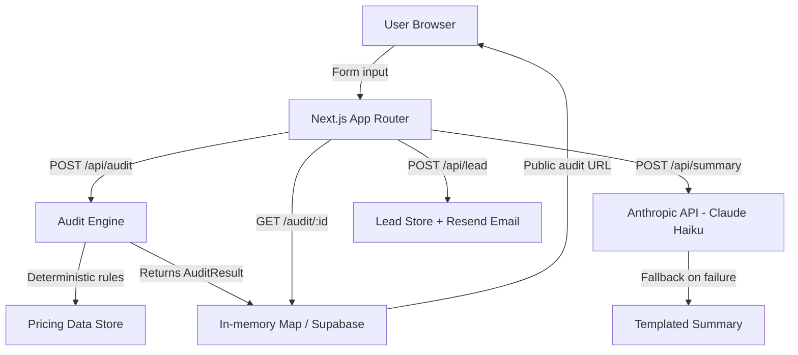

# Architecture

## System Diagram

## Data Flow: Input → Audit Result

1. **User fills form** — Zustand store (persisted to `localStorage`) holds tool entries (toolId, plan, seats, monthlySpend), teamSize, and useCase.

2. **Submit → POST /api/audit** — Form data sent as JSON. Server validates, calls `runAudit(formData)`.

3. **Audit engine** (`lib/audit-engine.ts`) —
   - For each tool: calls `evaluateTool()` with tool ID, plan, spend, seats, teamSize, useCase
   - Each tool has specific logic (e.g., Cursor Business with ≤3 users → downgrade to Pro, saves $40/seat)
   - After per-tool evaluation: `checkRedundancy()` looks for overlapping tools (e.g., Cursor + Copilot both running)
   - Returns `AuditResult` with per-tool recommendations and total savings

4. **Result stored** — `auditStore.set(id, result)` (Map for MVP; Supabase in production)

5. **Client redirects** → `/audit/:id` — Fetches result via GET, renders savings hero + per-tool breakdown

6. **AI summary** — Parallel call to `/api/summary` sends the AuditResult to Claude Haiku with a structured prompt. Falls back to a deterministic template if the API fails or is unconfigured.

7. **Lead capture** — User optionally submits email. Stored server-side; confirmation email sent via Resend.

## Stack Choice

| Layer | Choice | Rationale |
|-------|--------|-----------|
| Framework | Next.js 15 (App Router) | File-based routing, server actions, edge OG images, one-command Vercel deploy |
| Language | TypeScript | Assignment preference; catches pricing data type errors at compile time |
| State | Zustand + persist | Lightweight; automatic localStorage persistence for form state |
| Styling | Inline styles + CSS vars | No build step, easy dark theme, no class name collisions |
| AI | Anthropic Claude Haiku | Cheapest capable model for 100-word summaries; ~$0.0003/audit |
| Email | Resend | Best DX for transactional email; generous free tier |
| DB (MVP) | In-memory Map | Zero latency, zero setup for 7-day assignment |
| DB (prod) | Supabase | Open source, generous free tier, Postgres with JSON support |
| Deploy | Vercel | Zero-config Next.js deploys |

## Scaling to 10k Audits/Day

1. **Replace Map with Supabase** — One `auditStore` abstraction swap. Add index on `id` column.
2. **Redis rate limiting** — Replace in-memory `emailRateLimit` Map with Upstash Redis (`@upstash/ratelimit`).
3. **Audit result TTL** — Add `expires_at` to DB records; run nightly cleanup for audits >90 days old.
4. **AI summary queue** — At volume, move Claude Haiku calls to a background queue (Inngest / BullMQ) to avoid blocking the audit response.
5. **CDN for static assets** — Vercel Edge Network handles this automatically.
6. **Pricing data cache** — Currently in-memory (imported module). For 10k/day, no change needed — it's static data. For real-time pricing updates, add a daily Supabase cron job that fetches vendor pricing pages.

At 10k audits/day, Claude Haiku API cost ≈ $3/day. Supabase free tier handles ~500MB storage. Vercel Pro covers the compute. Total infra cost: ~$50/month.
